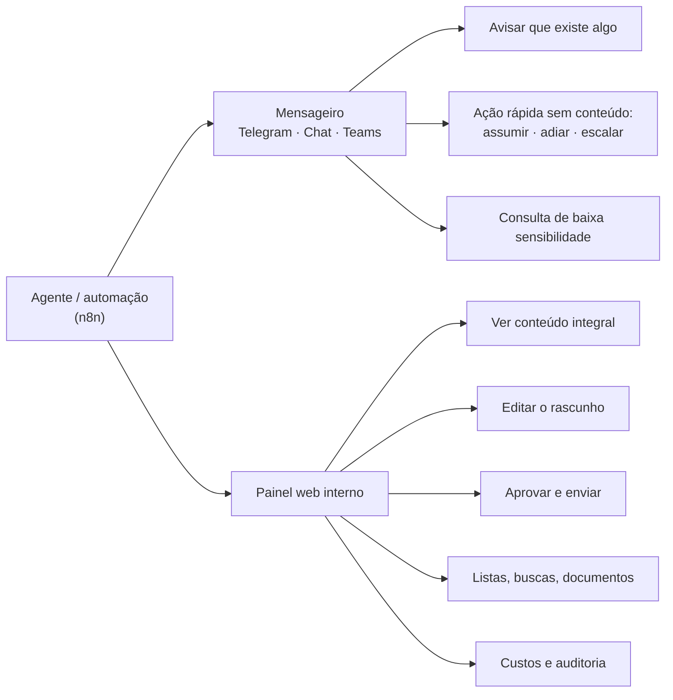

# Nota Técnica 01 — Canal de uso interno e hospedagem dos servidores MCP

| Campo | Valor |
|---|---|
| Status | Para decisão |
| Versão | 0.1 |
| Data | 2026-08-17 |
| Responde a | (1) Por onde a equipe interna aciona os agentes? Telegram serve? (2) Onde fica o servidor MCP? Dá para fazê-lo dentro do n8n? |
| Decisões geradas | D-16 a D-20 (ver `01-diretrizes-gerais.md` §13) |

---

# Parte 1 — Por onde a equipe interna aciona os agentes

## 1.1 O que essa interface precisa dar conta

Antes de comparar ferramentas, vale listar o que a interface interna precisa fazer. A lista sai das próprias diretrizes já acordadas:

| # | Necessidade | Origem |
|---|---|---|
| N1 | Identificar **quem** é a pessoa, de forma confiável e individual | §5.2 — conta compartilhada é proibida |
| N2 | Aplicar privilégios diferentes por papel | §5.3 |
| N3 | **Aprovar conteúdo integral** antes do envio externo | §6.3 — a aprovação recai sobre o texto final, não sobre um resumo |
| N4 | Permitir **editar** o rascunho antes de aprovar | §8.2 — saída de IA é rascunho até revisão |
| N5 | Notificar com urgência (prazo, intimação) | §8.3 |
| N6 | Exibir listas e documentos longos de forma legível | uso real |
| N7 | Registrar tudo em trilha auditável | §5, P5 |
| N8 | Manter sigilo profissional sobre o conteúdo trafegado | §9.2 |
| N9 | Encerrar acesso quando alguém sai do escritório | segurança |

Repare que **N3, N4 e N6 são de leitura e edição**, e **N5 é de notificação**. São naturezas diferentes, e nenhuma ferramenta única faz as duas bem. Esse é o fato que organiza a resposta.

## 1.2 As opções na mesa

| Opção | O que é | Esforço | Observação |
|---|---|---|---|
| **A. Mensageiro que a equipe já usa** | Telegram, WhatsApp, Slack, Google Chat, Microsoft Teams | Baixo | Adoção imediata, zero treinamento |
| **B. Painel web interno** | Aplicação construída para o projeto | Médio-alto | Controle total; é preciso construir e manter |
| **C. Chat embutido do n8n** | O n8n tem um nó de chat com interface hospedada | Muito baixo | Bom para protótipo; limitado para produção |
| **D. Dentro do Trello** | Comandos em comentários de card | Baixo | Só serve para o que já é um card |
| **E. E-mail** | A equipe responde por e-mail | Baixo | Lento e sem estrutura para aprovação |

## 1.3 Telegram, em detalhe

### Viabilidade: alta, imediata

O n8n tem integração nativa com Telegram (gatilho e envio). A API de bots é gratuita, não exige aprovação da plataforma nem processo de homologação. Dá para ter um bot funcionando em uma tarde.

### Vantagens

1. **Custo zero e sem burocracia.** Diferente do WhatsApp, não há taxa por conversa, não há homologação de número, não há aprovação de modelo de mensagem.
2. **Sem janela de 24 horas.** O bot pode mandar mensagem a qualquer momento. Para avisar de um prazo às 22h, isso importa — no WhatsApp exigiria um template aprovado.
3. **Botões nativos.** O Telegram permite botões embutidos na mensagem: `[Aprovar] [Editar] [Rejeitar]`. É o encaixe mais natural que existe para o fluxo de aprovação humana (§6.3), e evita que a pessoa tenha que digitar comandos.
4. **Identificador estável.** Cada usuário tem um ID numérico permanente, que não muda se a pessoa trocar de número ou de apelido. É mais confiável como chave do que o número de telefone do WhatsApp.
5. **Grupos e tópicos.** Dá para organizar por área ou por tipo de demanda dentro de um mesmo grupo.
6. **Multiplataforma de verdade.** Celular, desktop e navegador, com a mesma conversa sincronizada — a pessoa aprova do computador, onde ler um documento é viável.
7. **Vários bots.** Dá para separar um bot para colaboradores e outro para advogados, o que ajuda na organização (mas **não** é barreira de segurança — ver desvantagem 1).

### Desvantagens

Estas são as que pesam num escritório de advocacia, em ordem de gravidade:

1. **Sigilo profissional.** Conversas de bot no Telegram **nunca** são criptografadas ponta a ponta — a criptografia forte do Telegram vale só para "chats secretos", que não funcionam com bots. O conteúdo fica nos servidores do Telegram, empresa estrangeira sem contrato com o escritório. Dado de cliente trafegando ali é uma exposição que precisa de decisão consciente do escritório, não de omissão.

2. **Sem contrato de tratamento de dados.** Sob a LGPD, o escritório é controlador e o Telegram viraria operador **sem contrato** (§9.1). Google Workspace e Microsoft 365, por comparação, oferecem esse contrato. Isso não é formalidade: é o que sustenta a responsabilidade do escritório caso algo vaze.

3. **A identidade não é controlada pelo escritório.** Você não consegue exigir segundo fator, não consegue aplicar política de senha, e não consegue desligar a conta de alguém que saiu. Você só consegue remover o ID da sua lista de autorizados — o histórico de conversa continua no celular da pessoa, para sempre. Em Brasil, com a frequência de troca fraudulenta de chip, a tomada de conta é risco concreto.

4. **Limite de 20 MB para baixar arquivo.** O bot só consegue baixar arquivos de até 20 MB (e enviar até 50 MB). Petição digitalizada, processo com anexos e mídia estouram isso com frequência. Existe contorno — rodar um servidor próprio da API do Telegram, que eleva o limite para 2 GB — mas isso é mais infraestrutura para manter.

5. **Chat é ruim para revisar conteúdo.** Aprovar uma resposta de três parágrafos numa bolha de conversa é desconfortável. Editar antes de aprovar (N4) é pior ainda: teria que ser por reenvio de texto. Ler uma tabela de 40 processos no celular é inviável.

6. **Mistura pessoal e profissional.** Colaboradores usariam contas pessoais. Não há separação, não há apagamento remoto, não há retenção corporativa.

7. **Histórico não é trilha de auditoria.** Mensagens podem ser apagadas pelo usuário. A auditoria de verdade tem que estar no banco do sistema de qualquer forma (§10.1), mas o que a pessoa vê e o que ficou registrado passam a divergir.

8. **Limites de vazão:** 30 mensagens por segundo no total. Folgado para um escritório — não é preocupação real, mas fica registrado.

## 1.4 Recomendação: dois níveis, com uma regra que resolve o problema

A conclusão não é "Telegram sim" ou "Telegram não". É **separar por natureza**:

**Mensageiro = camada de notificação e ação rápida.**
**Painel web = camada de conteúdo, revisão e aprovação.**

E a regra que resolve a maior parte dos problemas de sigilo:

> **Conteúdo confidencial não vai no corpo da mensagem do mensageiro.** A mensagem carrega apenas a notificação e um link.

Na prática, em vez de o Telegram receber:

> *"Cliente Maria Silva pergunta sobre o processo 0801234-56.2024.8.03.0001 (ação de indenização contra…). Rascunho de resposta: 'Prezada Maria, informamos que…'"*

ele recebe:

> *"🔴 Demanda #4821 aguardando revisão · prazo em 2 dias*
> *[Abrir no painel] [Assumir] [Repassar]"*

O que trafega pelo Telegram é metadado operacional. O conteúdo só aparece no painel, atrás de autenticação do escritório, com registro de quem abriu e quando. O sigilo fica preservado, e ainda assim a equipe ganha a conveniência de ser avisada onde já está.

Isso também elimina as desvantagens 1, 2, 5 e 7 quase por completo, e reduz a 3 e a 6 — se a conta de Telegram de alguém for tomada, o invasor vê que existe uma demanda, mas não o que ela contém, e não consegue abrir o painel.

## 1.5 O canal corporativo exige plano pago? Análise de custo

**Resposta direta: a recomendação não exige contratar nada.** Ela é condicional — *"prefira o canal corporativo **que o escritório já tiver**"*. Se não houver nenhum, o Telegram é a escolha adequada, e não um consolo.

Mas vale entender o quadro, porque ele afeta também a frente de e-mail (F3).

### 1.5.1 Situação de cada opção

| Canal | Tem versão gratuita? | Dá para criar bot no plano gratuito? | Observação |
|---|---|---|---|
| **Telegram** | Sim, integralmente | **Sim, sem restrição** | Zero custo, zero burocracia |
| **Google Chat** | Só dentro do Google Workspace | **Não com conta `@gmail.com` comum** | A API de Chat exige conta Workspace; conta pessoal do Google não configura bot |
| **Google Workspace (Business Starter)** | Não — é pago | Sim | ~R$ 35 a R$ 42 por usuário/mês no plano anual |
| **Google Workspace Essentials Starter** | **Sim, gratuito** (até 100 usuários) | **Incerto** — ver abaixo | **Não inclui Gmail em domínio próprio.** É para quem já tem e-mail em outro lugar |
| **Microsoft 365 / Teams** | Teams tem versão gratuita | Limitado e mal documentado no gratuito | Se o escritório já paga M365, está resolvido |
| **Slack** | Sim | **Sim**, mas com teto de **10 aplicativos** no espaço inteiro, histórico de 90 dias e sem login único | Viável se já usarem |

### 1.5.2 O caso do Essentials Starter, e por que não resolve

Existe uma edição gratuita e permanente do Google Workspace — a **Essentials Starter** — que inclui Chat, Drive, Docs e Meet para até 100 usuários. À primeira vista pareceria a saída. Não é, por dois motivos:

1. **Ela não dá e-mail no domínio do escritório.** Foi feita justamente para quem já tem e-mail em outro provedor. Se o escritório precisa de `nome@escritorio.adv.br`, isso continua sendo contratado à parte.
2. **Não consegui confirmar se ela permite criar bot de Chat.** A documentação do Google lista as edições "Essentials" entre as que suportam aplicativos de Chat, mas o guia de configuração da API menciona conta "Business ou Enterprise". São afirmações que não se encaixam, e a Essentials Starter é a mais restrita da família. **Isso só se resolve testando na prática** — não vou afirmar em nenhuma direção.

Ou seja: caminho com custo de investigação e risco de não funcionar, para economizar algo que o Telegram já entrega de graça e com certeza. Não recomendo.

### 1.5.3 Vale a pena contratar Workspace só por causa disso? Não.

Fazendo a conta: a licença é **por usuário**, e todos os colaboradores que recebem notificação precisariam de uma. Para uma equipe de 12 pessoas, o Business Starter sai em torno de **R$ 420 a R$ 500 por mês** — algo como R$ 5.000 a R$ 6.000 por ano.

Gastar isso para ter um canal de notificação é investimento ruim, por uma razão específica deste projeto: **a decisão D-17 já neutralizou o problema que o canal corporativo resolveria.** Se o conteúdo confidencial não trafega no corpo da mensagem — só a notificação e o link — a diferença entre Telegram e Google Chat cai para quase nada. O que sobra é conveniência de identidade e desligamento de conta, que é bom, mas não vale R$ 6.000 por ano.

Esse mesmo dinheiro rende muito mais aplicado no painel web, que é o componente que de fato protege o conteúdo.

**Onde contratar Workspace ou M365 *se justifica*** é outra conversa: por causa do e-mail profissional, do armazenamento de documentos e da gestão de contas do escritório. Aí o Chat vem junto, de graça, e você aproveita. Mas a justificativa é o e-mail, não o bot.

### 1.5.4 O elo com a frente de e-mail

Vale notar: o projeto **precisa** monitorar a caixa de e-mail do escritório (F3). Isso significa que eles necessariamente já pagam por alguma coisa — Workspace, Microsoft 365, ou hospedagem com e-mail (Locaweb, Titan, Zoho, UOL Host). A pergunta 16 da descoberta vai revelar qual.

- Se a resposta for **Google Workspace** ou **Microsoft 365** → o canal corporativo já está pago, use Chat ou Teams e não se fala mais nisso.
- Se for **outro provedor de e-mail** → Telegram, com a regra D-17. Sem contratar nada.
- Se for **`@gmail.com` comum** → há um problema maior que o canal interno, e que precisa ser levantado com o escritório: e-mail profissional de advocacia em conta pessoal gratuita é frágil em continuidade, em controle de acesso e em imagem.

### 1.5.5 Ordem de preferência (revisada)

1. **Google Chat ou Microsoft Teams** — se o escritório já paga Workspace ou M365
2. **Slack** — se já usam (atenção ao teto de 10 aplicativos)
3. **Telegram** — se não usam nenhum canal corporativo. **Escolha legítima, não contingência**
4. **WhatsApp interno** — evitar: custo por conversa, janela de 24 h e confusão com o canal de clientes

## 1.6 Cenário confirmado: Workspace Business Starter com conta única compartilhada

O escritório confirmou que **paga Google Workspace Business Starter, mas toda a equipe usa uma única conta compartilhada**. Isso muda a análise em dois níveis: o que é tecnicamente possível no Google Chat, e um problema estrutural bem maior que o canal de notificação.

### 1.6.1 O que o Google Chat permite com contas externas

Um usuário com `@gmail.com` comum **pode** ser convidado para um espaço (grupo) do Google Chat do escritório, desde que o administrador habilite conversas e espaços externos no console. Ele entra como **convidado externo**, não como membro da organização.

Mas há um limite decisivo para este projeto, que consta da documentação de limitações conhecidas do Google Chat:

> **Usuários externos não conseguem interagir com aplicativos em um espaço.** Menções, comandos de barra, cliques em cards publicados pelo app — tudo isso fica desabilitado para eles.

Ou seja:

| Ação | Membro licenciado do Workspace | Convidado externo (`@gmail.com`) |
|---|:---:|:---:|
| Entrar no espaço e ler as mensagens | ✅ | ✅ (após convite) |
| **Ver** notificações publicadas pelo bot | ✅ | ✅ |
| Mencionar o bot (`@assistente`) | ✅ | ❌ |
| Usar comando de barra (`/consultar`) | ✅ | ❌ |
| **Clicar em botão de card** (`[Aprovar]`) | ✅ | ❌ |
| Conversa direta com o bot | ✅ | ❌ |

**Resposta direta às perguntas:** sim, os colaboradores conseguem entrar no grupo com Gmail pessoal e **ver** o que o bot publica. Mas **não conseguem acionar o bot nem clicar nos botões**. Para interagir, é preciso ser usuário licenciado dentro da conta paga do Workspace. Isso é restrição do próprio Google, não configuração ajustável.

Restaria usar o Chat como **mural de avisos somente-leitura** — o que joga fora justamente a vantagem que o tornava atraente (os botões de ação). Nesse papel reduzido, o Telegram faz o mesmo de graça e ainda deixa a pessoa responder.

### 1.6.2 O problema maior: a conta compartilhada

A restrição acima é secundária diante disto: **uma conta usada por todos significa que o sistema tem uma única identidade para o escritório inteiro.**

Isso colide de frente com o alicerce do projeto:

| O que quebra | Por quê |
|---|---|
| **Matriz de privilégios (§5.3)** | Não há como dar acesso diferente a advogado e colaborador se, do ponto de vista do sistema, existe uma pessoa só |
| **Aprovação humana (§6.3, faixas A3/A4)** | A faixa A4 exige aprovação **de advogado**. Com conta única, não há como comprovar que quem aprovou era advogado — nem quem foi |
| **Auditoria (P5)** | O registro diria sempre o mesmo nome. Em caso de vazamento ou erro, o escritório não consegue identificar a origem |
| **Regra explícita das diretrizes (§5.2)** | *"Conta compartilhada é proibida — inviabiliza auditoria e responsabilização"* |
| **Sigilo profissional e LGPD (§9)** | Como controlador, o escritório precisa saber quem acessou dado de qual cliente. Com conta única, não sabe |
| **Desligamento de pessoal** | Quem sai continua sabendo a senha. Trocar a senha obriga a avisar todo mundo — e na prática ninguém troca |
| **Termos do Google** | Licenças do Workspace são por usuário. Compartilhar uma conta entre a equipe contraria os termos e expõe a conta a suspensão |

Vale notar a ironia útil: **o Telegram gratuito daria identidade melhor do que o Workspace pago do escritório hoje.** Doze colaboradores no Telegram são doze identificadores distintos; doze colaboradores numa conta compartilhada do Workspace são um só.

Este achado extrapola o canal de notificação. Ele afeta a frente de e-mail (F3), o armazenamento de documentos e o modelo de identidade inteiro (§5). **Precisa ser levado ao escritório como questão de fundo, não como detalhe de configuração.**

### 1.6.3 Caminhos possíveis

**Caminho A — Licenças individuais do Workspace (correto e recomendado)**

Cada pessoa com sua conta `nome@escritorio.adv.br`. Custo: cerca de **R$ 35 a R$ 42 por usuário/mês** no plano anual do Business Starter. Para uma equipe de 12, algo em torno de **R$ 420 a R$ 500 por mês** no total — descontando a licença que já pagam.

Resolve de uma vez: identidade individual, segundo fator, desligamento controlado, auditoria de e-mail e documentos, conformidade com os termos do Google, **e** libera o Google Chat com botões para toda a equipe, sem contratar mais nada.

Não é gasto criado por este projeto — é uma correção que o escritório precisaria fazer de qualquer forma. O projeto apenas trouxe o problema à superfície.

✅ **Caminho B — Identidade no painel, notificação no Telegram — ESCOLHIDO PELO ESCRITÓRIO EM 27/08/2026 (D-147)**

> *"O escritório vai optar por usar o Telegram como canal de mensagens com o agente. Isso para evitar mais gastos no início da implementação do projeto. Serão contas individuais por colaborador e por advogados, todos devidamente identificados. Foi informado acerca das implicações disso, e o escritório aceitou os riscos."*
>
> A recomendação do §1.6.4 era o Caminho A. O escritório optou pelo B, com ciência — é decisão dele, e está registrada. O Caminho A continua sendo a correção certa e pode ser retomado depois, **sem retrabalho na plataforma**: o núcleo de identidade não muda (§8 do documento 04). O que a escolha cobra está registrado em **R-47**, e o que ela **não** resolve, em **R-11** — e-mail e Drive seguem numa conta única, o que afeta a frente F3.

A identidade sai do Google e passa a viver no **painel web** do projeto: login individual por pessoa, com segundo fator, na base de usuários da própria plataforma. O mensageiro vira apenas um cano de aviso.

- Notificação: **Telegram**, um identificador por pessoa, custo zero
- Conteúdo, edição e aprovação: painel, com identidade real e registro nominal
- Google Chat: não utilizável como canal interativo neste cenário

Funciona e mantém a auditoria de pé — mas deixa e-mail e documentos do escritório continuarem sem responsabilização individual, o que é problema deles, não do projeto. **Precisa ser dito com clareza ao escritório**, para que a decisão seja consciente.

**Caminho C — Híbrido com Cloud Identity Free**

O Google oferece o **Cloud Identity Free**, que dá até 50 contas gerenciadas no domínio do escritório **sem custo**. Essas contas não incluem Gmail nem Agenda, mas dão identidade individual no domínio, utilizável para login único no painel do projeto.

Assim: advogados e quem precisa de e-mail próprio ficam com licença paga do Workspace; os demais recebem conta gratuita de identidade só para acessar o painel. Reduz o custo mantendo identidade individual.

Duas ressalvas: **não confirmei se o Cloud Identity Free dá acesso ao Google Chat** (a documentação lista Drive, Docs, Meet e outros, mas não menciona Chat), e há mais complexidade de administração. O valor dele aqui é a **identidade individual barata**, não o Chat.

### 1.6.4 Recomendação

1. **Levar o problema da conta compartilhada ao escritório agora**, antes do PRD. Ele afeta o desenho de identidade inteiro, e refazer isso depois é caro.
2. **Recomendar o Caminho A** — é a correção certa, e o custo é modesto perto do que o escritório já gasta em Trello, Escavador e no próprio projeto.
3. **Desenhar a plataforma para funcionar no Caminho B de qualquer maneira.** O painel precisa ter identidade própria independentemente do que o Google ofereça — isso é bom desenho, e evita que a plataforma fique refém de uma decisão administrativa do cliente.
4. **Não usar Google Chat como canal interativo** enquanto a equipe não tiver contas individuais licenciadas. Até lá, Telegram.

## 1.7 Faseamento sugerido

| Fase | Interface | Racional |
|---|---|---|
| **Piloto** | Mensageiro + chat embutido do n8n, restrito a fluxos que **não** retornam dado de cliente (status de fila, custos, tarefas) | Valida a automação sem construir painel e sem expor dado sensível |
| **Produção interna** | Painel web com "caixa de aprovações" + notificação no mensageiro | Habilita as frentes F2 e F3 de verdade |
| **Evolução** | Painel ganha busca, dashboards, configuração e auditoria | Conforme uso real |

O painel não precisa ser grande na primeira versão. Uma tela de "caixa de aprovações" — lista de pendências, conteúdo integral, editar, aprovar, rejeitar — já destrava as frentes internas. Isso é dias de trabalho, não meses.

---

# Parte 2 — Onde fica o servidor MCP

## 2.1 O que é um servidor MCP, sem jargão

É um programa pequeno que fica ligado o tempo todo, entre o agente de IA e a API externa. Ele faz três coisas:

1. **Apresenta um cardápio** ao agente: "estas são as ações que você pode pedir" (consultar processo, criar monitoramento, buscar por CPF…).
2. **Traduz** o pedido do agente na chamada técnica correta à API do Escavador ou do Trello, com a credencial certa.
3. **Devolve** o resultado em formato que o agente consiga usar.

Não é uma máquina grande nem cara. É um serviço leve — comparável, em consumo, a um site institucional. Dois desses cabem folgadamente no mesmo servidor que já roda o n8n.

O valor dele é ser **um lugar só**: a credencial do Escavador fica ali (e não espalhada por dezenas de automações), o controle de gasto fica ali, o registro de auditoria fica ali, e o limite de requisições fica ali. Qualquer agente de IA — o do n8n hoje, outro amanhã, o de outro cliente seu depois — se conecta no mesmo lugar e ganha tudo isso de graça.

## 2.2 Fazer o servidor MCP dentro do n8n

**É tecnicamente possível.** O n8n tem um nó chamado *MCP Server Trigger*, que transforma um workflow em servidor MCP: ele publica um endereço, e clientes MCP se conectam a ele. As ferramentas expostas são workflows do próprio n8n. A autenticação é por token (Bearer ou cabeçalho customizado), sobre HTTP.

### Vantagens

1. **Nada novo para hospedar.** Usa a infraestrutura que você já tem.
2. **Edição visual.** Você trabalha na interface que já domina, sem escrever código.
3. **Aproveita o cofre de credenciais do n8n.**
4. **Rápido para começar e rápido para mudar.**
5. **Outros clientes conseguem se conectar** (Claude Desktop, por exemplo, com um adaptador).

### Desvantagens

Em ordem de peso para **este** projeto:

1. **Contradiz o motivo de existir do servidor.** Você pediu MCP justamente para reaproveitar em outros projetos e agentes. Um servidor dentro do n8n fica **preso ao n8n desse escritório**: à instância deles, à licença deles, à disponibilidade deles. Reaproveitar em outro cliente significaria montar outro n8n e recriar tudo. Um servidor em código separado é um pacote que você instala onde quiser, em minutos. **Esta é a objeção decisiva.**

2. **A superfície da API é grande demais para manter no visual.** A API do Escavador tem dezenas de operações. No n8n, cada ferramenta vira um workflow ou uma ramificação — algo como 40 a 60 fluxos mantidos à mão numa interface gráfica. Em código, é um punhado de arquivos que compartilham a mesma base.

3. **O que é comum a todas as ferramentas vira cópia.** Controle de vazão (500 req/min), contagem de créditos, cache com validade por tipo de dado, repetição em caso de falha, paginação: em código, isso se escreve **uma vez** e vale para todas as ferramentas. No n8n, teria que ser replicado em cada fluxo — e, na prática, replicado com pequenas diferenças que ninguém percebe até dar problema.

4. **Não dá para testar de verdade.** Workflow não tem teste automatizado significativo. Para um componente que **gasta dinheiro por chamada** e manipula dado sob sigilo, isso é fraqueza séria: qualquer alteração exige teste manual.

5. **A autenticação é um token único, sem noção de quem está pedindo.** É exatamente o que a decisão D-03 (§6.2) precisa: escopos por sessão, cardápio filtrado por papel, validação de parâmetro conforme privilégio. O nó do n8n autentica o *cliente*, não o *usuário*, e expõe um conjunto fixo de ferramentas. O modelo de privilégios do projeto não caberia ali.

6. **Versionamento fraco.** Código tem versão, histórico e registro de mudanças — o que consumidores externos precisam para confiar. Workflow tem "editado por fulano, ontem".

7. **Custo operacional escondido.** Cada chamada de ferramenta vira uma execução de workflow registrada no banco do n8n. Com volume, isso incha o banco e polui o histórico de execuções.

## 2.3 Recomendação: dividir por natureza, não escolher um lado

A resposta certa usa as duas coisas, cada uma no que é boa:

| | **Em código, serviço separado** | **Dentro do n8n (MCP Server Trigger)** |
|---|---|---|
| **O que vai aqui** | MCP Escavador · MCP Trello | "MCP do Escritório": criar demanda, mover card para a fase seguinte do fluxo, consultar acervo interno, registrar atendimento |
| **Natureza** | Genérico, reutilizável, superfície grande, gasta dinheiro, precisa de escopo por papel | Específico do escritório, poucas ferramentas, muda com frequência |
| **Por quê** | É o ativo reaproveitável — precisa ser portátil, testado e versionado | Por P6 (§3), regra de negócio do escritório **não pode** entrar no MCP genérico. E aqui o visual é vantagem: muda rápido, sem deploy |

Isso não é meio-termo por indecisão: encaixa exatamente no princípio P6 que já está nas diretrizes — *"os servidores MCP não podem conter regra de negócio do escritório"*. O que sobra de regra de negócio precisa morar em algum lugar, e o n8n é o lugar certo para ela.

**Exceção útil:** para o **protótipo** do Escavador, montar duas ou três ferramentas no n8n primeiro, só para validar o fluxo antes de escrever código, é uma boa ideia. Protótipo descartável, não fundação.

## 2.4 Onde hospedar fisicamente

| Opção | Recomendação | Comentário |
|---|---|---|
| **Mesmo servidor do n8n, em contêineres separados** | ✅ **Recomendado** | Os servidores MCP ficam na rede interna, **sem exposição à internet**. O n8n os alcança por endereço interno. Mais barato, mais rápido, menos superfície de ataque |
| Servidor próprio separado | Só se necessário | Isolamento maior, custo e manutenção maiores. Justifica-se se o volume crescer ou se houver exigência de separação |
| Plataforma gerenciada (Railway, Render, Fly.io, Cloud Run) | Avaliar depois | Operação mais fácil, mas o dado sai do perímetro do escritório e entra custo recorrente. Reavaliar quando houver um segundo consumidor externo |
| Sua máquina local | ❌ | Serve para desenvolver, nunca para produção |

**Sobre expor para fora:** enquanto o único consumidor for o n8n do escritório, os servidores MCP **não devem** ter endereço público. Quando surgir um segundo consumidor — o Claude Desktop de um advogado, outro projeto seu — a exposição se faz com proxy reverso, HTTPS, autenticação por token e restrição de origem. Deixar aberto "porque vai precisar depois" é criar risco sem contrapartida.

**Requisito de recurso:** cada servidor MCP consome pouco — na ordem de 256 a 512 MB de memória. Se o servidor atual do n8n tem 4 GB ou mais, cabe sem alteração de plano. Confirmar com as perguntas 50 a 53 do questionário de descoberta.

## 2.5 Comparação de esforço

Estimativa grosseira, para dimensionar a conversa — não é orçamento:

| Abordagem | Construir | Manter | Reaproveitar em outro projeto |
|---|---|---|---|
| MCP Escavador em código | Maior no início | Baixo (testes protegem) | **Horas** — instala e configura |
| MCP Escavador no n8n | Menor no início | Alto (cresce com o número de fluxos) | **Semanas** — recriar em outro n8n |
| MCP do Escritório no n8n | Baixo | Baixo | Não se aplica — é específico por natureza |

O código custa mais nas primeiras semanas e menos em todas as seguintes. Como o reuso é requisito declarado do projeto, e não desejo vago, a conta fecha a favor do código para o Escavador e o Trello.

---

# Decisões propostas

| ID | Decisão | Recomendação |
|---|---|---|
| **D-16** | Interface interna em dois níveis: mensageiro para notificação e ação rápida; painel web para conteúdo, edição e aprovação | Adotar |
| **D-17** | Conteúdo confidencial não trafega no corpo da mensagem do mensageiro — apenas notificação e link | Adotar |
| **D-18** | Canal de notificação: **Telegram**, enquanto a equipe não tiver contas individuais do Workspace. Google Chat só passa a ser viável no Caminho A (§1.6.3) | ✅ **Confirmada** (escritório, 27/08) — e o Telegram deixa de ser só cano de aviso: passa a carregar também a **identidade individual** (D-147) |
| **D-21** | Identidade individual é pré-requisito do projeto. Levar a conta compartilhada ao escritório e recomendar licenças individuais; desenhar o painel com identidade própria de qualquer forma (§1.6) | ✅ **Confirmada e cumprida** (escritório, 27/08) — pelo **Caminho B**. A segunda metade da decisão ("desenhar o painel com identidade própria de qualquer forma") é o que evitou retrabalho |
| **D-19** | MCP Escavador e MCP Trello em código, como serviços separados — **não** dentro do n8n | Adotar |
| **D-20** | Hospedar os servidores MCP em contêineres no mesmo servidor do n8n, sem exposição pública | Adotar |

---

## Fontes consultadas

- [n8n Docs — MCP Server Trigger](https://docs.n8n.io/integrations/builtin/core-nodes/n8n-nodes-langchain.mcptrigger)
- [n8n Docs — Connect to n8n MCP server](https://docs.n8n.io/connect/connect-to-n8n-mcp-server)
- [Telegram Bot API](https://core.telegram.org/bots/api)
- [Telegram Bots FAQ](https://core.telegram.org/bots/faq)
- [Google Workspace — comparar planos e preços](https://workspace.google.com/pricing)
- [Google Workspace Help — edições Essentials](https://support.google.com/a/answer/7681288)
- [Google for Developers — Configure the Google Chat API](https://developers.google.com/workspace/chat/configure-chat-api)
- [Slack — Usage limits for free workspaces](https://slack.com/help/articles/115002422943-Usage-limits-for-free-workspaces)
- [Google Workspace Help — Google Chat known limitations](https://support.google.com/a/answer/9296435)
- [Google Workspace Help — Chatting with external users & guest accounts](https://knowledge.workspace.google.com/admin/chat/chatting-with-external-users)
- [Google Workspace Help — Control external Chat & spaces chat options](https://support.google.com/a/answer/9269229)
- [Cloud Identity — Editions](https://docs.cloud.google.com/identity/docs/editions)
- [Cloud Identity Help — Your Cloud Identity free edition user cap](https://support.google.com/cloudidentity/answer/7295541)
