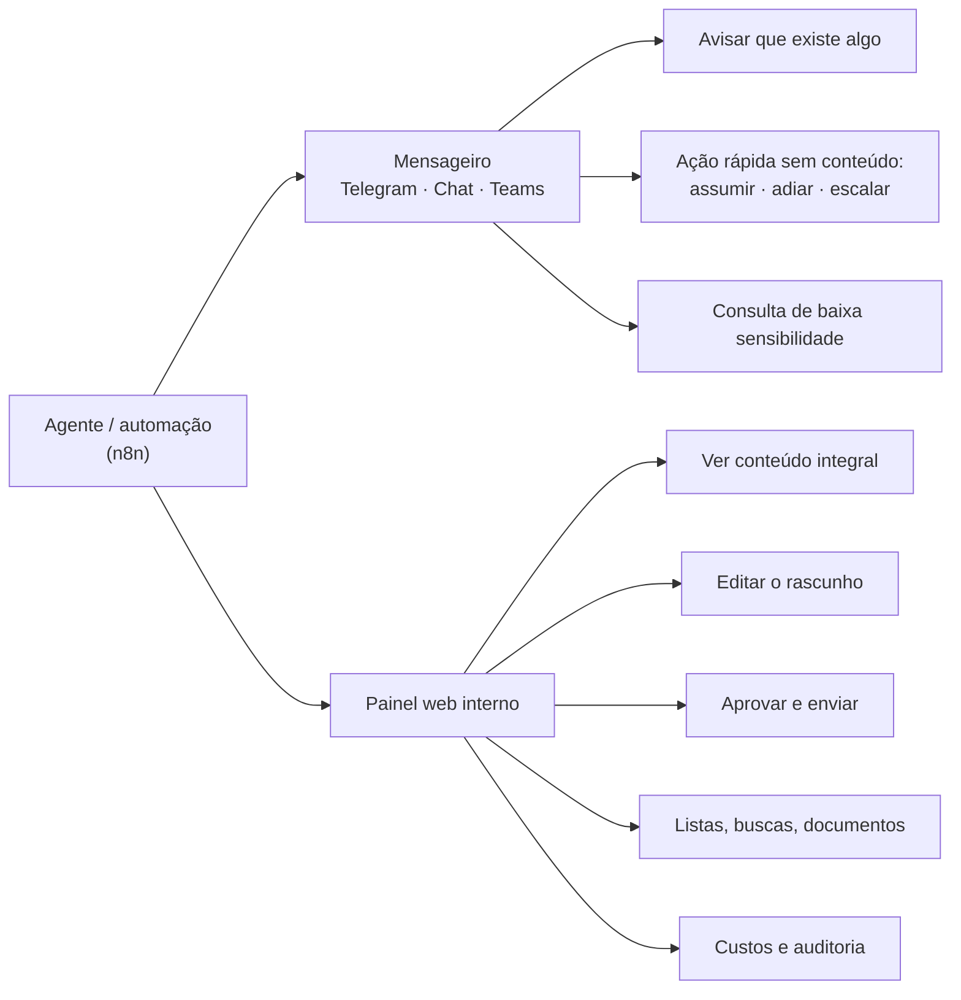

# Nota Técnica 01 — Canal de uso interno e hospedagem dos servidores MCP

| Campo | Valor |
|---|---|
| Status | Para decisão |
| Versão | 0.1 |
| Data | 2026-08-17 |
| Responde a | (1) Por onde a equipe interna aciona os agentes? Telegram serve? (2) Onde fica o servidor MCP? Dá para fazê-lo dentro do n8n? |
| Decisões geradas | D-16 a D-20 (ver `01-diretrizes-gerais.md` §13) |

---

# Parte 1 — Por onde a equipe interna aciona os agentes

## 1.1 O que essa interface precisa dar conta

Antes de comparar ferramentas, vale listar o que a interface interna precisa fazer. A lista sai das próprias diretrizes já acordadas:

| # | Necessidade | Origem |
|---|---|---|
| N1 | Identificar **quem** é a pessoa, de forma confiável e individual | §5.2 — conta compartilhada é proibida |
| N2 | Aplicar privilégios diferentes por papel | §5.3 |
| N3 | **Aprovar conteúdo integral** antes do envio externo | §6.3 — a aprovação recai sobre o texto final, não sobre um resumo |
| N4 | Permitir **editar** o rascunho antes de aprovar | §8.2 — saída de IA é rascunho até revisão |
| N5 | Notificar com urgência (prazo, intimação) | §8.3 |
| N6 | Exibir listas e documentos longos de forma legível | uso real |
| N7 | Registrar tudo em trilha auditável | §5, P5 |
| N8 | Manter sigilo profissional sobre o conteúdo trafegado | §9.2 |
| N9 | Encerrar acesso quando alguém sai do escritório | segurança |

Repare que **N3, N4 e N6 são de leitura e edição**, e **N5 é de notificação**. São naturezas diferentes, e nenhuma ferramenta única faz as duas bem. Esse é o fato que organiza a resposta.

## 1.2 As opções na mesa

| Opção | O que é | Esforço | Observação |
|---|---|---|---|
| **A. Mensageiro que a equipe já usa** | Telegram, WhatsApp, Slack, Google Chat, Microsoft Teams | Baixo | Adoção imediata, zero treinamento |
| **B. Painel web interno** | Aplicação construída para o projeto | Médio-alto | Controle total; é preciso construir e manter |
| **C. Chat embutido do n8n** | O n8n tem um nó de chat com interface hospedada | Muito baixo | Bom para protótipo; limitado para produção |
| **D. Dentro do Trello** | Comandos em comentários de card | Baixo | Só serve para o que já é um card |
| **E. E-mail** | A equipe responde por e-mail | Baixo | Lento e sem estrutura para aprovação |

## 1.3 Telegram, em detalhe

### Viabilidade: alta, imediata

O n8n tem integração nativa com Telegram (gatilho e envio). A API de bots é gratuita, não exige aprovação da plataforma nem processo de homologação. Dá para ter um bot funcionando em uma tarde.

### Vantagens

1. **Custo zero e sem burocracia.** Diferente do WhatsApp, não há taxa por conversa, não há homologação de número, não há aprovação de modelo de mensagem.
2. **Sem janela de 24 horas.** O bot pode mandar mensagem a qualquer momento. Para avisar de um prazo às 22h, isso importa — no WhatsApp exigiria um template aprovado.
3. **Botões nativos.** O Telegram permite botões embutidos na mensagem: `[Aprovar] [Editar] [Rejeitar]`. É o encaixe mais natural que existe para o fluxo de aprovação humana (§6.3), e evita que a pessoa tenha que digitar comandos.
4. **Identificador estável.** Cada usuário tem um ID numérico permanente, que não muda se a pessoa trocar de número ou de apelido. É mais confiável como chave do que o número de telefone do WhatsApp.
5. **Grupos e tópicos.** Dá para organizar por área ou por tipo de demanda dentro de um mesmo grupo.
6. **Multiplataforma de verdade.** Celular, desktop e navegador, com a mesma conversa sincronizada — a pessoa aprova do computador, onde ler um documento é viável.
7. **Vários bots.** Dá para separar um bot para colaboradores e outro para advogados, o que ajuda na organização (mas **não** é barreira de segurança — ver desvantagem 1).

### Desvantagens

Estas são as que pesam num escritório de advocacia, em ordem de gravidade:

1. **Sigilo profissional.** Conversas de bot no Telegram **nunca** são criptografadas ponta a ponta — a criptografia forte do Telegram vale só para "chats secretos", que não funcionam com bots. O conteúdo fica nos servidores do Telegram, empresa estrangeira sem contrato com o escritório. Dado de cliente trafegando ali é uma exposição que precisa de decisão consciente do escritório, não de omissão.

2. **Sem contrato de tratamento de dados.** Sob a LGPD, o escritório é controlador e o Telegram viraria operador **sem contrato** (§9.1). Google Workspace e Microsoft 365, por comparação, oferecem esse contrato. Isso não é formalidade: é o que sustenta a responsabilidade do escritório caso algo vaze.

3. **A identidade não é controlada pelo escritório.** Você não consegue exigir segundo fator, não consegue aplicar política de senha, e não consegue desligar a conta de alguém que saiu. Você só consegue remover o ID da sua lista de autorizados — o histórico de conversa continua no celular da pessoa, para sempre. Em Brasil, com a frequência de troca fraudulenta de chip, a tomada de conta é risco concreto.

4. **Limite de 20 MB para baixar arquivo.** O bot só consegue baixar arquivos de até 20 MB (e enviar até 50 MB). Petição digitalizada, processo com anexos e mídia estouram isso com frequência. Existe contorno — rodar um servidor próprio da API do Telegram, que eleva o limite para 2 GB — mas isso é mais infraestrutura para manter.

5. **Chat é ruim para revisar conteúdo.** Aprovar uma resposta de três parágrafos numa bolha de conversa é desconfortável. Editar antes de aprovar (N4) é pior ainda: teria que ser por reenvio de texto. Ler uma tabela de 40 processos no celular é inviável.

6. **Mistura pessoal e profissional.** Colaboradores usariam contas pessoais. Não há separação, não há apagamento remoto, não há retenção corporativa.

7. **Histórico não é trilha de auditoria.** Mensagens podem ser apagadas pelo usuário. A auditoria de verdade tem que estar no banco do sistema de qualquer forma (§10.1), mas o que a pessoa vê e o que ficou registrado passam a divergir.

8. **Limites de vazão:** 30 mensagens por segundo no total. Folgado para um escritório — não é preocupação real, mas fica registrado.

## 1.4 Recomendação: dois níveis, com uma regra que resolve o problema

A conclusão não é "Telegram sim" ou "Telegram não". É **separar por natureza**:

**Mensageiro = camada de notificação e ação rápida.**
**Painel web = camada de conteúdo, revisão e aprovação.**

E a regra que resolve a maior parte dos problemas de sigilo:

> **Conteúdo confidencial não vai no corpo da mensagem do mensageiro.** A mensagem carrega apenas a notificação e um link.

Na prática, em vez de o Telegram receber:

> *"Cliente Maria Silva pergunta sobre o processo 0801234-56.2024.8.03.0001 (ação de indenização contra…). Rascunho de resposta: 'Prezada Maria, informamos que…'"*

ele recebe:

> *"🔴 Demanda #4821 aguardando revisão · prazo em 2 dias*
> *[Abrir no painel] [Assumir] [Repassar]"*

O que trafega pelo Telegram é metadado operacional. O conteúdo só aparece no painel, atrás de autenticação do escritório, com registro de quem abriu e quando. O sigilo fica preservado, e ainda assim a equipe ganha a conveniência de ser avisada onde já está.

Isso também elimina as desvantagens 1, 2, 5 e 7 quase por completo, e reduz a 3 e a 6 — se a conta de Telegram de alguém for tomada, o invasor vê que existe uma demanda, mas não o que ela contém, e não consegue abrir o painel.

## 1.5 Se o escritório já usa Google Workspace ou Microsoft 365

Vale checar antes de decidir pelo Telegram (é a pergunta 16 do questionário de descoberta). Se usarem, **Google Chat ou Microsoft Teams são estritamente melhores** para o papel de camada de notificação:

- mesma conveniência de mensageiro e mesmos botões de ação;
- **já cobertos pelo contrato de tratamento de dados** que o escritório tem com o fornecedor;
- **identidade corporativa** — a mesma conta do e-mail, com segundo fator, e que é desligada quando a pessoa sai;
- ambos têm integração nativa no n8n.

Nesse cenário, o Telegram deixa de ter vantagem: ele ganha por ser fácil, mas perde nos pontos que mais importam aqui. A regra de "sem conteúdo no corpo" pode até ser relaxada num canal corporativo contratado.

**Ordem de preferência recomendada para a camada de notificação:**

1. Google Chat ou Microsoft Teams — se o escritório já usa um deles
2. Slack — se já usam
3. Telegram — se não usam nenhum canal corporativo
4. WhatsApp interno — evitar: custo por conversa, janela de 24 h e confusão com o canal de clientes

## 1.6 Faseamento sugerido

| Fase | Interface | Racional |
|---|---|---|
| **Piloto** | Mensageiro + chat embutido do n8n, restrito a fluxos que **não** retornam dado de cliente (status de fila, custos, tarefas) | Valida a automação sem construir painel e sem expor dado sensível |
| **Produção interna** | Painel web com "caixa de aprovações" + notificação no mensageiro | Habilita as frentes F2 e F3 de verdade |
| **Evolução** | Painel ganha busca, dashboards, configuração e auditoria | Conforme uso real |

O painel não precisa ser grande na primeira versão. Uma tela de "caixa de aprovações" — lista de pendências, conteúdo integral, editar, aprovar, rejeitar — já destrava as frentes internas. Isso é dias de trabalho, não meses.

---

# Parte 2 — Onde fica o servidor MCP

## 2.1 O que é um servidor MCP, sem jargão

É um programa pequeno que fica ligado o tempo todo, entre o agente de IA e a API externa. Ele faz três coisas:

1. **Apresenta um cardápio** ao agente: "estas são as ações que você pode pedir" (consultar processo, criar monitoramento, buscar por CPF…).
2. **Traduz** o pedido do agente na chamada técnica correta à API do Escavador ou do Trello, com a credencial certa.
3. **Devolve** o resultado em formato que o agente consiga usar.

Não é uma máquina grande nem cara. É um serviço leve — comparável, em consumo, a um site institucional. Dois desses cabem folgadamente no mesmo servidor que já roda o n8n.

O valor dele é ser **um lugar só**: a credencial do Escavador fica ali (e não espalhada por dezenas de automações), o controle de gasto fica ali, o registro de auditoria fica ali, e o limite de requisições fica ali. Qualquer agente de IA — o do n8n hoje, outro amanhã, o de outro cliente seu depois — se conecta no mesmo lugar e ganha tudo isso de graça.

## 2.2 Fazer o servidor MCP dentro do n8n

**É tecnicamente possível.** O n8n tem um nó chamado *MCP Server Trigger*, que transforma um workflow em servidor MCP: ele publica um endereço, e clientes MCP se conectam a ele. As ferramentas expostas são workflows do próprio n8n. A autenticação é por token (Bearer ou cabeçalho customizado), sobre HTTP.

### Vantagens

1. **Nada novo para hospedar.** Usa a infraestrutura que você já tem.
2. **Edição visual.** Você trabalha na interface que já domina, sem escrever código.
3. **Aproveita o cofre de credenciais do n8n.**
4. **Rápido para começar e rápido para mudar.**
5. **Outros clientes conseguem se conectar** (Claude Desktop, por exemplo, com um adaptador).

### Desvantagens

Em ordem de peso para **este** projeto:

1. **Contradiz o motivo de existir do servidor.** Você pediu MCP justamente para reaproveitar em outros projetos e agentes. Um servidor dentro do n8n fica **preso ao n8n desse escritório**: à instância deles, à licença deles, à disponibilidade deles. Reaproveitar em outro cliente significaria montar outro n8n e recriar tudo. Um servidor em código separado é um pacote que você instala onde quiser, em minutos. **Esta é a objeção decisiva.**

2. **A superfície da API é grande demais para manter no visual.** A API do Escavador tem dezenas de operações. No n8n, cada ferramenta vira um workflow ou uma ramificação — algo como 40 a 60 fluxos mantidos à mão numa interface gráfica. Em código, é um punhado de arquivos que compartilham a mesma base.

3. **O que é comum a todas as ferramentas vira cópia.** Controle de vazão (500 req/min), contagem de créditos, cache com validade por tipo de dado, repetição em caso de falha, paginação: em código, isso se escreve **uma vez** e vale para todas as ferramentas. No n8n, teria que ser replicado em cada fluxo — e, na prática, replicado com pequenas diferenças que ninguém percebe até dar problema.

4. **Não dá para testar de verdade.** Workflow não tem teste automatizado significativo. Para um componente que **gasta dinheiro por chamada** e manipula dado sob sigilo, isso é fraqueza séria: qualquer alteração exige teste manual.

5. **A autenticação é um token único, sem noção de quem está pedindo.** É exatamente o que a decisão D-03 (§6.2) precisa: escopos por sessão, cardápio filtrado por papel, validação de parâmetro conforme privilégio. O nó do n8n autentica o *cliente*, não o *usuário*, e expõe um conjunto fixo de ferramentas. O modelo de privilégios do projeto não caberia ali.

6. **Versionamento fraco.** Código tem versão, histórico e registro de mudanças — o que consumidores externos precisam para confiar. Workflow tem "editado por fulano, ontem".

7. **Custo operacional escondido.** Cada chamada de ferramenta vira uma execução de workflow registrada no banco do n8n. Com volume, isso incha o banco e polui o histórico de execuções.

## 2.3 Recomendação: dividir por natureza, não escolher um lado

A resposta certa usa as duas coisas, cada uma no que é boa:

| | **Em código, serviço separado** | **Dentro do n8n (MCP Server Trigger)** |
|---|---|---|
| **O que vai aqui** | MCP Escavador · MCP Trello | "MCP do Escritório": criar demanda, mover card para a fase seguinte do fluxo, consultar acervo interno, registrar atendimento |
| **Natureza** | Genérico, reutilizável, superfície grande, gasta dinheiro, precisa de escopo por papel | Específico do escritório, poucas ferramentas, muda com frequência |
| **Por quê** | É o ativo reaproveitável — precisa ser portátil, testado e versionado | Por P6 (§3), regra de negócio do escritório **não pode** entrar no MCP genérico. E aqui o visual é vantagem: muda rápido, sem deploy |

Isso não é meio-termo por indecisão: encaixa exatamente no princípio P6 que já está nas diretrizes — *"os servidores MCP não podem conter regra de negócio do escritório"*. O que sobra de regra de negócio precisa morar em algum lugar, e o n8n é o lugar certo para ela.

**Exceção útil:** para o **protótipo** do Escavador, montar duas ou três ferramentas no n8n primeiro, só para validar o fluxo antes de escrever código, é uma boa ideia. Protótipo descartável, não fundação.

## 2.4 Onde hospedar fisicamente

| Opção | Recomendação | Comentário |
|---|---|---|
| **Mesmo servidor do n8n, em contêineres separados** | ✅ **Recomendado** | Os servidores MCP ficam na rede interna, **sem exposição à internet**. O n8n os alcança por endereço interno. Mais barato, mais rápido, menos superfície de ataque |
| Servidor próprio separado | Só se necessário | Isolamento maior, custo e manutenção maiores. Justifica-se se o volume crescer ou se houver exigência de separação |
| Plataforma gerenciada (Railway, Render, Fly.io, Cloud Run) | Avaliar depois | Operação mais fácil, mas o dado sai do perímetro do escritório e entra custo recorrente. Reavaliar quando houver um segundo consumidor externo |
| Sua máquina local | ❌ | Serve para desenvolver, nunca para produção |

**Sobre expor para fora:** enquanto o único consumidor for o n8n do escritório, os servidores MCP **não devem** ter endereço público. Quando surgir um segundo consumidor — o Claude Desktop de um advogado, outro projeto seu — a exposição se faz com proxy reverso, HTTPS, autenticação por token e restrição de origem. Deixar aberto "porque vai precisar depois" é criar risco sem contrapartida.

**Requisito de recurso:** cada servidor MCP consome pouco — na ordem de 256 a 512 MB de memória. Se o servidor atual do n8n tem 4 GB ou mais, cabe sem alteração de plano. Confirmar com as perguntas 50 a 53 do questionário de descoberta.

## 2.5 Comparação de esforço

Estimativa grosseira, para dimensionar a conversa — não é orçamento:

| Abordagem | Construir | Manter | Reaproveitar em outro projeto |
|---|---|---|---|
| MCP Escavador em código | Maior no início | Baixo (testes protegem) | **Horas** — instala e configura |
| MCP Escavador no n8n | Menor no início | Alto (cresce com o número de fluxos) | **Semanas** — recriar em outro n8n |
| MCP do Escritório no n8n | Baixo | Baixo | Não se aplica — é específico por natureza |

O código custa mais nas primeiras semanas e menos em todas as seguintes. Como o reuso é requisito declarado do projeto, e não desejo vago, a conta fecha a favor do código para o Escavador e o Trello.

---

# Decisões propostas

| ID | Decisão | Recomendação |
|---|---|---|
| **D-16** | Interface interna em dois níveis: mensageiro para notificação e ação rápida; painel web para conteúdo, edição e aprovação | Adotar |
| **D-17** | Conteúdo confidencial não trafega no corpo da mensagem do mensageiro — apenas notificação e link | Adotar |
| **D-18** | Canal de notificação: preferir o corporativo já contratado (Google Chat / Teams / Slack); Telegram apenas se não houver | Confirmar com pergunta 16 da descoberta |
| **D-19** | MCP Escavador e MCP Trello em código, como serviços separados — **não** dentro do n8n | Adotar |
| **D-20** | Hospedar os servidores MCP em contêineres no mesmo servidor do n8n, sem exposição pública | Adotar |

---

## Fontes consultadas

- [n8n Docs — MCP Server Trigger](https://docs.n8n.io/integrations/builtin/core-nodes/n8n-nodes-langchain.mcptrigger)
- [n8n Docs — Connect to n8n MCP server](https://docs.n8n.io/connect/connect-to-n8n-mcp-server)
- [Telegram Bot API](https://core.telegram.org/bots/api)
- [Telegram Bots FAQ](https://core.telegram.org/bots/faq)
