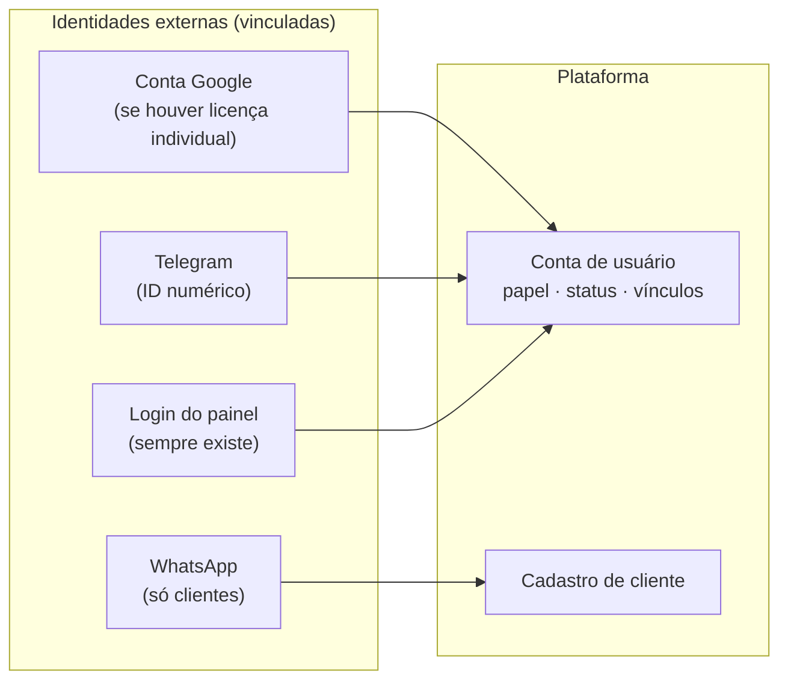
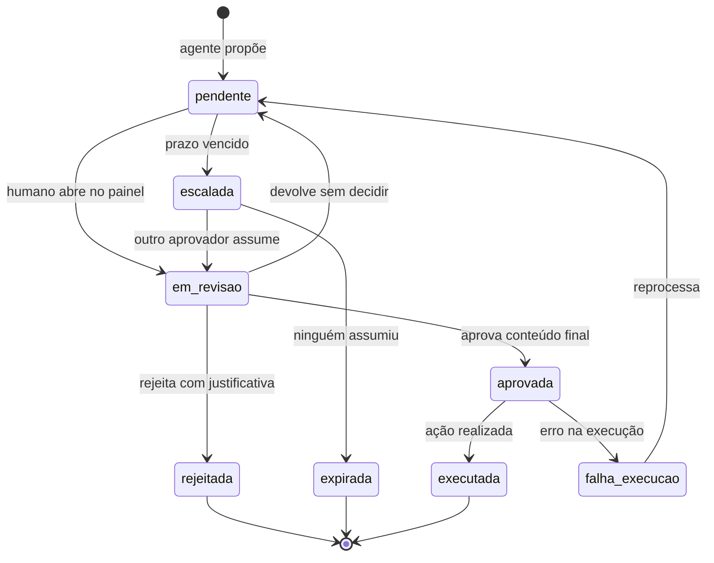

# Modelo de Identidade, Autorização, Aprovação e Auditoria

| Campo | Valor |
|---|---|
| Status | Rascunho para validação |
| Versão | 0.1 |
| Data | 2026-08-17 |
| Depende de | Nada pendente. **Vale igualmente nos Caminhos A e B** da Nota Técnica 01 §1.6 |
| Alimenta | PRD, Spec, servidores MCP, painel web, workflows n8n |

> **Por que este documento existe agora.** É a peça que mais coisas dependem — os dois servidores MCP, o painel e todos os fluxos do n8n consomem este modelo — e é a que **menos depende de decisão pendente**. O risco R-11 (conta compartilhada do Workspace) também a tornou urgente: quanto antes a identidade estiver desenhada, menor a chance de o desenho ficar refém de uma escolha administrativa do escritório.

---

## 1. Princípio fundador: a identidade é da plataforma

A regra que sustenta todo o resto:

> **A plataforma mantém seu próprio registro de pessoas. Provedores externos — Google, Telegram, WhatsApp — são *vinculados* a uma conta da plataforma; eles nunca *são* a conta.**

Parece detalhe, mas é o que resolve três problemas de uma vez:

1. **Independência da decisão do escritório.** Se comprarem licenças individuais do Workspace, o Google vira um provedor vinculado. Se não comprarem, o login próprio do painel cumpre o papel. **O núcleo do sistema não muda.**
2. **Múltiplos canais, uma pessoa.** A mesma advogada é uma conta só, acessível pelo painel, pelo Telegram e (eventualmente) pelo Google. A auditoria a enxerga como uma pessoa, não como três.
3. **Desligamento real.** Desativar a conta da plataforma corta todos os canais de uma vez, mesmo os que o escritório não administra.



**Consequência de projeto:** o login por senha do painel é obrigatório desde a primeira versão. Login único via Google, se vier, é conveniência adicional — nunca a única porta.

---

## 2. Modelo de dados

Entidades e campos essenciais. Não é a modelagem final (isso é da Spec), mas fixa o vocabulário e as relações.

### 2.1 Identidade

**`usuario`** — pessoa da equipe do escritório
`id` · `nome` · `email` · `papel` (colaborador · advogado · administrador) · `numero_oab` (quando advogado) · `areas` · `status` (ativo · suspenso · desligado) · `mfa_habilitado` · `criado_em` · `desligado_em`

**`identidade_externa`** — vínculo com um provedor
`id` · `usuario_id` · `provedor` (painel · google · telegram) · `identificador_externo` · `verificada_em` · `revogada_em`

> Restrição: um `identificador_externo` pertence a **um** usuário por provedor. Isso é o que impede que uma conta compartilhada seja aceita silenciosamente pelo sistema.

**`sessao`** — sessão autenticada, com escopos concedidos
`id` · `usuario_id` · `canal` · `escopos` · `sujeitos_autorizados` · `emitida_em` · `expira_em` · `revogada_em`

### 2.2 Domínio do escritório

**`cliente`** — `id` · `nome` · `tipo` (PF · PJ) · `documento` (CPF/CNPJ) · `status`

**`vinculo_canal_cliente`** — como o cliente é reconhecido em cada canal
`id` · `cliente_id` · `canal` (whatsapp · email) · `identificador` · `verificado_em` · `verificado_por` · `revogado_em`

> **O vínculo é criado pelo escritório, nunca por autodeclaração no chat.** É a materialização de §5.2 das diretrizes.

**`processo`** — `id` · `numero_cnj` · `cliente_id` · `advogado_responsavel_id` · `area` · `status` · `sigiloso`

**`demanda`** — unidade de trabalho, venha de onde vier
`id` · `origem` (email · whatsapp · interno · trello) · `referencia_origem` · `cliente_id` · `processo_id` · `classificacao` · `prioridade` · `prazo` · `status` · `responsavel_id` · `criada_em`

### 2.3 Governança

**`aprovacao`** — pedido de autorização humana
`id` · `demanda_id` · `faixa` (A0–A4) · `acao_proposta` · `conteudo_proposto` · `conteudo_final` · `solicitante` (usuário ou agente) · `aprovador_id` · `papel_exigido` · `status` (pendente · aprovada · rejeitada · expirada · escalada) · `criada_em` · `expira_em` · `decidida_em` · `justificativa`

**`evento_auditoria`** — append-only, nunca alterado nem removido
`id` · `momento` · `usuario_id` · `papel` · `canal` · `sessao_id` · `acao` · `recurso` · `parametros_resumidos` · `resultado` · `custo_centavos` · `aprovacao_id` · `origem_ip`

**`consumo`** — razão de custo por chamada paga
`id` · `evento_auditoria_id` · `fornecedor` (escavador · modelo_ia) · `operacao` · `custo_centavos` · `usuario_id` · `cliente_id` · `processo_id` · `cache_hit`

**`orcamento`** — `id` · `escopo` (sessao · usuario · escritorio) · `referencia` · `periodo` · `limite_centavos` · `consumido_centavos` · `estado` (normal · alerta · bloqueado)

---

## 3. Escopos

### 3.1 Convenção de nomes

```
<sistema>:<recurso>:<ação>[:<abrangência>]
```

| Parte | Valores | Exemplo |
|---|---|---|
| `sistema` | `escavador` · `trello` · `escritorio` · `documentos` | `escavador` |
| `recurso` | definido no mapeamento de cada API | `processo` |
| `ação` | `read` · `write` · `delete` | `read` |
| `abrangência` | `own` · `carteira` · `any` (ausente = irrestrita) | `own` |

Exemplos: `escavador:processo:read:own` · `escavador:monitoramento:write` · `trello:card:write` · `escritorio:demanda:read:carteira`

### 3.2 O que cada abrangência significa

| Abrangência | Regra aplicada pelo servidor MCP |
|---|---|
| `own` | O documento (CPF/CNPJ) ou número de processo consultado **precisa constar** na lista `sujeitos_autorizados` da sessão. Fora dela, a chamada é recusada — mesmo que o agente insista |
| `carteira` | O recurso precisa pertencer à carteira do usuário, resolvida pelo Policy Gate e entregue na sessão |
| `any` | Sem restrição de sujeito. Continua sujeito a quota e a registro |

Esta é a parte que faz o §6.2 das diretrizes funcionar de verdade: **a restrição é verificada em código, no servidor, com dados que o agente não controla.** Injeção de prompt não alcança.

### 3.3 Escopos por papel — estrutura preliminar

A lista definitiva sai do mapeamento de cada API. A estrutura já pode ser fixada:

| Papel | Padrão de concessão |
|---|---|
| **Cliente** | Apenas leitura, sempre com abrangência `own`, sobre um conjunto reduzido de recursos, com quota de custo apertada |
| **Colaborador** | Leitura ampla com abrangência `carteira`, escrita em recursos internos, quota moderada. Consulta paga acima do teto exige aprovação |
| **Advogado** | Leitura `any`, escrita ampla, aprovação de faixas A3 e A4, quota alta |
| **Administrador** | Configuração, orçamentos, gestão de usuários e leitura da auditoria. **Não recebe escopo de dado de cliente por padrão** — separação entre administrar o sistema e acessar o conteúdo |

---

## 4. Contrato do Policy Gate

O Policy Gate é o serviço que responde: *"esta pessoa, neste canal, pode fazer isto — e com que limites?"*. É consultado pela orquestração **antes** de abrir a sessão MCP.

### 4.1 Pedido

```json
{
  "provedor": "telegram",
  "identificador_externo": "584219773",
  "canal": "telegram",
  "intencao": "consultar_andamento_processual",
  "contexto": {
    "processo_numero": "0801234-56.2024.8.03.0001"
  },
  "requisicao_id": "req_01HQ..."
}
```

### 4.2 Resposta — autorizado

```json
{
  "decisao": "permitido",
  "usuario": {
    "id": "usr_014",
    "nome": "...",
    "papel": "colaborador",
    "areas": ["civel"]
  },
  "sessao": {
    "id": "ses_01HQ...",
    "token": "<token de sessão MCP>",
    "expira_em": "2026-08-17T15:12:00Z"
  },
  "escopos": [
    "escavador:processo:read:carteira",
    "escavador:movimentacao:read:carteira",
    "trello:card:write",
    "escritorio:demanda:read:carteira"
  ],
  "sujeitos_autorizados": {
    "documentos": ["12345678000199"],
    "processos": ["0801234-56.2024.8.03.0001"]
  },
  "orcamento": {
    "restante_sessao_centavos": 800,
    "restante_usuario_centavos": 42000,
    "estado": "normal"
  },
  "exigencias": [
    { "acao": "consulta_certidao", "requer": "aprovacao_advogado" }
  ]
}
```

### 4.3 Resposta — negado

```json
{
  "decisao": "negado",
  "motivo_codigo": "identidade_nao_vinculada",
  "mensagem_usuario": "Não foi possível concluir. Procure o responsável pelo sistema.",
  "requisicao_id": "req_01HQ..."
}
```

### 4.4 Regras do contrato

1. **Falha fecha** (P10). Policy Gate indisponível ⇒ nada é autorizado. Nunca há liberação por omissão.
2. **Sessão curta.** Minutos, não horas. Mudança de papel ou desligamento tem efeito rápido.
3. **A mensagem ao usuário nunca revela a razão técnica.** *"Não localizei"* e *"não autorizado"* são indistinguíveis para quem está fora — caso contrário o sistema vira oráculo de existência de processos (§10.3).
4. **Toda decisão é registrada**, inclusive as negativas. Negativa é sinal de segurança.
5. **Escopos são concedidos, nunca deduzidos pelo agente.** O agente recebe a lista pronta.
6. **`sujeitos_autorizados` é o coração do isolamento** entre clientes. Ele é resolvido contra o cadastro do escritório, jamais contra o que veio na mensagem.

---

## 5. Fluxo de aprovação humana

### 5.1 Faixas e rito

| Faixa | Rito | Quem pode decidir | Prazo padrão |
|---|---|---|---|
| **A0** Leitura interna | Automático | — | — |
| **A1** Leitura externa paga | Automático dentro da quota; acima, aprovação | Advogado | 4 h |
| **A2** Escrita interna | Automático, reversível, registrado | — | — |
| **A3** Comunicação externa | Aprovação obrigatória | Advogado | 4 h úteis |
| **A4** Efeito jurídico ou prazo | Aprovação obrigatória, **sem exceção** | Advogado, nominalmente | 2 h úteis |

### 5.2 Estados



### 5.3 Regras

1. **Aprova-se o conteúdo final**, não a intenção. O texto exato que sairá é o que aparece na tela.
2. **Edição antes de aprovar é obrigatória no fluxo** — `conteudo_proposto` e `conteudo_final` são campos distintos, e a diferença entre eles é métrica de qualidade do agente.
3. **Expiração nunca é silenciosa.** Escala e alerta. Aprovação pendente esquecida é demanda perdida.
4. **A4 exige advogado identificado nominalmente.** Se não houver identidade individual, **a faixa A4 não pode ser liberada** — trava de projeto, e a razão pela qual R-11 é grave.
5. **Rejeição pede justificativa.** É o que alimenta a melhoria dos agentes.

---

## 6. Auditoria

**Todo** evento registra: momento · usuário · papel · canal · sessão · ação · recurso · resumo dos parâmetros · resultado · custo · aprovação vinculada.

Regras:

- **Append-only.** Sem update, sem delete, nem por administrador.
- **Registra a negativa** com o mesmo rigor da permissão.
- **Parâmetros resumidos, nunca íntegra de dado sensível.** A auditoria prova o que aconteceu; não é cópia do acervo.
- **Retenção definida por tipo**, com expurgo automatizado (§9.1 das diretrizes).
- **Consultável pelo administrador**, e pelo advogado quanto aos próprios atos.

---

## 7. Custo e quota

Três níveis de orçamento, verificados em cadeia — o mais restritivo vence:

```
sessão  →  usuário/mês  →  escritório/mês
```

| Estado | Gatilho | Comportamento |
|---|---|---|
| `normal` | Abaixo de 80% | Opera normalmente |
| `alerta` | 80% a 100% | Opera e notifica o administrador |
| `bloqueado` | 100% | Só cache. Consulta nova exige aprovação de advogado |

O custo em centavos vem do cabeçalho de resposta da API do Escavador e é gravado em `consumo`, atribuído a usuário, cliente e processo — o que torna o gasto **repassável** e analisável por caso.

---

## 8. Por que este modelo funciona nos dois caminhos

O ponto que torna seguro construir isto antes da decisão do escritório:

| Componente | Caminho A (licenças individuais) | Caminho B (só painel + Telegram) |
|---|---|---|
| `usuario` | Idêntico | Idêntico |
| `identidade_externa` | Linhas com provedor `google`, `telegram`, `painel` | Linhas com provedor `telegram`, `painel` |
| Login no painel | Senha própria **ou** login único Google | Senha própria |
| Escopos, sessão, Policy Gate | Idêntico | Idêntico |
| Aprovação e auditoria | Idêntico | Idêntico |
| Custo e quota | Idêntico | Idêntico |
| Canal de notificação | Google Chat com botões | Telegram com botões |
| Faixa A4 liberada? | ✅ Sim | ✅ Sim — a identidade vem do painel |

**A diferença é uma tabela de vínculos e o conector do mensageiro.** Nada estrutural. É exatamente o que a decisão D-21 buscava garantir.

---

## 9. O que ainda depende do mapeamento das APIs

Fica em aberto de propósito, para ser preenchido nas fases seguintes:

- Lista concreta de escopos do Escavador (`escavador:*`) — depende do mapeamento
- Lista concreta de escopos do Trello (`trello:*`) — idem
- Classificação de cada operação nas faixas A0–A4
- Custo típico por operação, para calibrar as quotas
- Regras de validade de cache por tipo de dado

A **estrutura** acima não muda quando essas listas chegarem. Só cresce.

---

## 10. Decisões geradas

| ID | Decisão | Recomendação |
|---|---|---|
| **D-22** | A plataforma mantém registro próprio de usuários; provedores externos são vinculados, nunca são a conta | Adotar |
| **D-23** | Login por senha próprio no painel desde a primeira versão; login único é conveniência adicional | Adotar |
| **D-24** | Convenção de escopos `<sistema>:<recurso>:<ação>[:<abrangência>]`, com `own` / `carteira` / `any` verificadas no servidor MCP | Adotar |
| **D-25** | Faixa A4 permanece bloqueada enquanto não houver identidade individual de advogado | Adotar |
| **D-26** | Administrador não recebe escopo de dado de cliente por padrão — administrar o sistema e acessar conteúdo são coisas separadas | Adotar |
