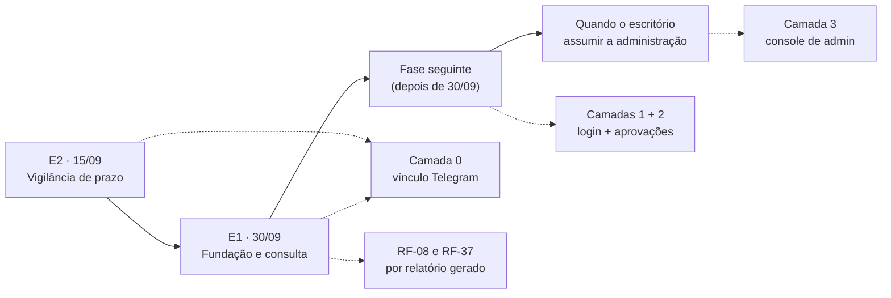

# Nota Técnica 04 — O painel web e a administração da plataforma

| Campo | Valor |
|---|---|
| Status | Para decisão |
| Versão | 1.0 |
| Data | 2026-09-08 |
| Responde a | (1) Existe painel ou interface web para colaboradores e advogados? (2) Existe painel de administração? (3) Por onde o super admin gerencia o projeto em produção? |
| Decisões geradas | D-223 a D-225 (ver `01-diretrizes-gerais.md` §13) |
| Riscos gerados | R-78 e R-79 (ver `01-diretrizes-gerais.md` §15) |
| Documentos afetados | `01-diretrizes-gerais.md` (§13 e §15), `04-modelo-de-identidade-e-autorizacao.md` (§1 e §3.3), `08-prd.md` (§3.1, RF-08, RF-37), `09-spec-tecnica.md` (§15), `17-plano-de-execucao.md`, `00-estado-atual.md` |

---

## 1. Resposta curta

| Pergunta | Resposta |
|---|---|
| **Existe previsão de painel web?** | **Sim** — a D-16 o prevê desde 17/08, e três decisões acordadas dependem dele (D-147, D-17, RF-01). **Mas ele não está em nenhum marco de construção**, não tem especificação, telas nem estimativa |
| **Existe painel de administração?** | **Não.** O papel *administrador* existe no modelo de dados com sete atribuições escritas, e **a palavra "painel administrativo" aparece uma única vez no projeto inteiro** — numa célula da tabela de personas do PRD (§3.1). Nada além disso |
| **Por onde o super admin gerencia hoje?** | **Pelo painel de cada fornecedor, e é você quem opera** — editor do n8n, Portainer, pgAdmin, painel do Escavador, Trello. Não existe um lugar onde alguém veja "quem gastou o quê" ou desligue uma pessoa |

Esta nota não inventa um componente novo. Ela faz três coisas: **separa** o que estava colado numa palavra só, **datas** cada parte, e **escreve o que fica descoberto** enquanto cada parte não existir — porque a omissão é que era o problema, não a ausência.

---

## 2. Como o painel entrou no projeto sem nunca ter sido planejado

Vale reconstruir, porque o padrão se repete e vale a pena reconhecê-lo antes da próxima vez.

| Quando | O que aconteceu | Efeito sobre o painel |
|---|---|---|
| **17/08** | Nota Técnica 01 compara canais internos e conclui pelos **dois níveis** (D-16): mensageiro avisa, painel mostra conteúdo | Nasce como **recomendação de canal**, com a frase *"não precisa ser grande na primeira versão… dias de trabalho, não meses"* |
| **17/08** | A mesma nota resolve o sigilo do Telegram com a **D-17**: conteúdo confidencial não vai no corpo da mensagem, só notificação e **link** | O painel vira **o destino do link** — deixa de ser conveniência |
| **19/08** | O Modelo de Identidade fixa que a identidade é da plataforma, e escreve: *"o login por senha do painel é obrigatório desde a primeira versão"* | O painel vira **a porta de entrada da identidade** |
| **27/08** | O escritório escolhe o **Caminho B** (D-147): *"a identidade sai do Google e passa a viver no painel web do projeto"* | O painel vira **condição da RF-01** |
| **26/08** | A Spec Técnica lista os **dez marcos** de construção da fundação | **O painel não é nenhum deles** |
| **06/09** | O Plano de Execução detalha E1 como *"uma consulta processual funcionando ponta a ponta pelo Telegram"* | O painel **também não entra no cronograma** |

**A causa não é descuido, é forma.** O painel entrou pela porta de uma *nota de canal*, e as decisões seguintes foram pendurando peso nele **por referência** — cada uma citando "o painel" como se ele já fosse um componente planejado. Ninguém precisou decidir construí-lo, porque ninguém percebeu que estava dependendo dele. É o mesmo mecanismo que produziu as três colisões de numeração (§13 de `01`): **uma sessão herda um vocabulário e supõe que o que ele nomeia existe.**

---

## 3. "Painel" são três coisas, e é isso que torna o assunto grande demais

A palavra vinha sendo usada para três componentes de tamanho, dono e urgência diferentes. Separá-los é o que permite datar cada um.

### Camada 0 — o que existe hoje (vínculo Telegram ↔ usuário)

Não é painel, e é importante nomeá-la para não subestimar o que já está de pé.

Uma pessoa é identificada pelo **ID numérico do Telegram** (um número permanente que a conta carrega, independente de apelido ou número de telefone), cadastrado pelo escritório e ligado a uma linha da tabela `usuario` na base da plataforma.

| Isso cumpre | Isso **não** cumpre |
|---|---|
| Identidade **individual** — duas pessoas produzem registros de auditoria distintos | Autenticação **da plataforma** — quem controla o acesso é o Telegram, não nós |
| Rejeição de conta compartilhada — um ID pertence a um usuário só | Segundo fator **que a plataforma exija** — a RNF-18 exige 2FA *na conta do Telegram*, e a conferência disso é declaratória (alguém afirma que ativou) |
| Revogação do vínculo — tirar o ID da lista corta o acesso à plataforma | Superfície para **ler conteúdo** fora do Telegram — a D-17 manda o conteúdo para um link que não existe |

> ⚠️ **A leitura correta da RF-01 hoje.** O critério de aceite dela é *"duas pessoas distintas produzem registros de auditoria distintos; conta compartilhada é rejeitada"* — e **a camada 0 cumpre isso**. O que ela não cumpre é o texto do documento 04 (*"login por senha do painel, obrigatório desde a primeira versão"*) e o da D-147 (*"login individual por pessoa, com segundo fator, na base de usuários da própria plataforma"*). **A RF-01 fica parcialmente cumprida, e isso precisa estar escrito** — não descoberto depois por alguém lendo o documento 04 e supondo que o login existe.

### Camada 1 — Conta e login

A porta. Login por e-mail e senha, segundo fator **TOTP** (código de seis dígitos que troca a cada 30 segundos, gerado por aplicativo no celular — Google Authenticator e similares), primeiro acesso, troca de senha, e o **pareamento do Telegram** (a pessoa loga no painel, recebe um código, manda para o bot, e o vínculo se cria sozinho, verificado).

| Item | Valor |
|---|---|
| Telas | 6 — login, primeiro acesso, configurar 2FA, entrar com 2FA, trocar senha, parear Telegram |
| Já existe | As tabelas `usuario`, `identidade_externa` e `sessao` (Marco 1) |
| Falta | Guarda de senha com *hash* (a senha nunca é gravada legível — grava-se um resumo irreversível dela), TOTP, sessão de navegador, e as telas |
| Esforço estimado | **3 a 5 dias úteis** |

> **Uma observação que muda a prioridade dela:** login sozinho é **porta para uma sala vazia**. Sem a camada 2 (o que ler) e sem a camada 3 (o que administrar), a pessoa entra e não há nada para fazer. A camada 1 só passa a valer o esforço **junto** de uma das outras duas — ou no dia em que o pareamento verificado do Telegram substituir o cadastro manual do vínculo, que é ganho real, mas pequeno.

### Camada 2 — Caixa de aprovações e leitura de conteúdo

O componente que a **D-17 exige**, e o único que resolve um problema que hoje não tem solução: *onde a pessoa lê o conteúdo integral que não pode trafegar no Telegram*.

| Item | Valor |
|---|---|
| Telas | 5 — lista de pendências, conteúdo integral com edição, aprovar/rejeitar com registro nominal, alerta de prazo com teor, busca simples |
| Depende de | Camada 1 (não faz sentido sem login) |
| Destrava | A **D-17** inteira; a §6.3 (aprovar o texto final, não o resumo); a edição antes de aprovar (N4); o item 1 da **D-211** (alerta mostra que há prazo, e o teor fica no link) |
| Pré-requisito de | **E3** (respostas a e-mail com aprovação) e **E4** (atendimento ao cliente) |
| Esforço estimado | **5 a 8 dias úteis** |

### Camada 3 — Console de administração

O "painel do super admin". Usuários (cadastrar, suspender, desligar), orçamentos e tetos, leitura da auditoria, consumo de crédito por pessoa e período, relatório de acesso amplo, inventário de vigilâncias.

| Item | Valor |
|---|---|
| Telas | 6 — usuários, orçamentos, auditoria, custo, acesso amplo, vigilâncias |
| Cumpre | **RF-08**, **RF-37**, **D-26**, e as atribuições de administrador do documento 04 §3.3 |
| Esforço estimado | **5 a 8 dias úteis** |
| Estado | **Fora de escopo por decisão (D-224)** — o super admin da fase 1 é o prestador, por acesso técnico |

---

## 4. O faseamento proposto

| Entrega | O que tem de painel | Por quê |
|---|---|---|
| **E2 · 15/09** | **Nada.** Camada 0 apenas | E2 é notificação e confirmação por botão (D-222). Cabe inteira no Telegram, e o item 1 da D-211 já manda o alerta mostrar **que** há prazo sem o teor — o que se perde é o link para ler o teor, e isso fica registrado como limitação aceita, não como pendência esquecida |
| **E1 · 30/09** | **Nada de tela.** RF-08 e RF-37 por **relatório gerado** (D-225) | E1 pelo Telegram, como o plano já diz. Os dois requisitos que a D-219 devolveu ao escopo se cumprem sem interface: o critério de aceite da RF-37 pede *"o relatório existe e é gerado sem consulta manual ao banco"*, e o da RF-08 pede responder *"quem gastou o quê no mês"* — nenhum dos dois exige tela para ser verdade |
| **Fase seguinte** | **Camadas 1 + 2, juntas** | É o par que faz sentido: login que abre a caixa de aprovações. Pré-requisito de E3 e E4, que é onde conteúdo de cliente passa a circular em volume. **8 a 13 dias úteis estimados** |
| **Quando o escritório assumir** | Camada 3 | Hoje o administrador é o prestador (D-224). O dia em que isso mudar é decisão de negócio, não de engenharia |

> **O que este faseamento custa, dito na frente.** Enquanto a camada 2 não existir, **a D-17 não tem para onde apontar** — e a pressão para colocar conteúdo no corpo da mensagem do Telegram cresce a cada uso, porque é o único lugar onde a pessoa consegue ler. Isso é o **R-78**, e não se resolve com disciplina: resolve-se com a camada 2 ou com uma regra escrita de o que pode e o que não pode aparecer na mensagem.

---

## 5. Por onde o super admin gerencia hoje — e o que isso cobra

### 5.1 O retrato honesto

Não existe console. O gerenciamento em produção acontece assim:

| O que se administra | Onde | Quem | Observação |
|---|---|---|---|
| Fluxos, execuções, credenciais | Editor do n8n | Prestador | A chave da API do n8n não tem escopo fora do Enterprise (R-38) |
| Contêineres, variáveis de ambiente, segredos | **Portainer** | Prestador | 🔴 Exposto na internet (**R-62**) — o item mais grave em aberto |
| Banco de dados | **pgAdmin**, por porta publicada | Prestador | 🔴 5432 e 5433 abertas à internet (**R-63**) |
| Saldo, tokens, callbacks | Painel do Escavador | Prestador | Diagnóstico sai do corpo bruto, nunca do painel (D-120, R-44) |
| Quadro de demandas | Trello | Escritório | Vitrine, não fonte da verdade (D-152) |
| Contas de pessoas | **Nenhum lugar** | — | Cadastro e desligamento são ato técnico no banco |

**Duas coisas se leem dessa tabela.** A primeira é que o super admin do projeto **é o prestador**, e as ferramentas dele são as de cada fornecedor. A segunda é que **as três linhas de infraestrutura estão vermelhas** — o console que hoje existe de fato (Portainer) é justamente o que está publicado na internet sem precisar estar.

### 5.2 O que a escolha da D-224 cobra

A decisão de manter o super admin como acesso técnico do prestador é a certa para a fase 1 — barata, imediata, e proporcional a um escritório de sete pessoas com um prestador só. Ela cobra três coisas, e todas precisam estar escritas:

1. **O escritório não consegue desligar ninguém sozinho.** É a necessidade **N9** da Nota Técnica 01 (*"encerrar acesso quando alguém sai do escritório"*), e ela deixa de ter dono do lado do escritório. Somada ao **R-47** (a conta de Telegram não é administrada pelo escritório), o resultado é: uma pessoa que sai numa sexta às 18h continua com acesso até o prestador executar a revogação. Isso é o **R-79**.

2. **Reforça o R-48.** O prestador já é operador de dados (D-148) e já responde tecnicamente ao encarregado; agora é também o administrador da plataforma. Quem opera, quem administra e quem apura são a mesma pessoa. Em escritório pequeno com prestador único isso é normal e administrável — vira problema no dia de um incidente, e o encaminhamento já registrado no R-48 continua valendo: **o encarregado perante o titular e a ANPD é a Malu, sempre.**

3. **A D-26 fica com uma nota de rodapé.** A decisão diz que *administrador não recebe escopo de dado de cliente por padrão* — separar administrar o sistema de acessar o conteúdo. Isso continua valendo **dentro da plataforma**, e é exatamente por isso que precisa ser dito: **acesso técnico ao banco atravessa a D-26 inteira**. O que preserva a separação não é a permissão, é a auditoria imutável do Marco 3, que registra até o que o dono do banco faz.

---

## 6. O que muda em cada documento

| Documento | Mudança |
|---|---|
| `01-diretrizes-gerais.md` | D-223, D-224, D-225 na §13; R-78 e R-79 na §15 |
| `04-modelo-de-identidade-e-autorizacao.md` | §1 — a frase *"o login por senha do painel é obrigatório desde a primeira versão"* ganha a data em que passa a valer. §3.3 — o papel **administrador** ganha nota dizendo onde ele opera na fase 1 |
| `08-prd.md` | §3.1 — a coluna de canal do administrador deixa de dizer só "Painel administrativo". RF-08 e RF-37 ganham o critério por relatório (D-225) |
| `09-spec-tecnica.md` | §15 — nota após a tabela dos dez marcos, dizendo que o painel é fase seguinte e apontando para cá |
| `17-plano-de-execucao.md` | §7 (Bloco 3) — as camadas 1 e 2 entram como trabalho de depois de 15/09 |
| `00-estado-atual.md` | Linha nova no cabeçalho |

---

## 7. Decisões que este documento propõe

| # | Decisão | Recomendação |
|---|---|---|
| **D-223** | O "painel" se separa em **três camadas** com datas próprias — conta e login, caixa de aprovações, console de administração —, e nenhuma delas entra em E2 nem em E1 | Adotar |
| **D-224** | O **super admin da fase 1 é o prestador, por acesso técnico direto**. Não existe console de administração, e o escritório não administra a plataforma | Adotar, com o R-79 registrado |
| **D-225** | **RF-08 e RF-37 são cumpridas por relatório gerado**, não por tela, enquanto a camada 3 não existir | Adotar |

---

## 8. Riscos que este documento levanta

| # | Risco |
|---|---|
| **R-78** | A D-17 não tem destino enquanto a camada 2 não existir — o link não aponta para lugar nenhum, e a pressão para pôr conteúdo no Telegram cresce com o uso |
| **R-79** | O escritório não tem como revogar acesso de ninguém sem o prestador — a necessidade N9 fica sem dono do lado de quem tem o interesse |

---

## 9. Próximo passo

Esta nota precisa de **aval** nas três decisões. Depois dele, o único trabalho que ela cria antes de 30/09 é o da **D-225** — os dois relatórios —, e ele já estava no escopo pela D-219.
